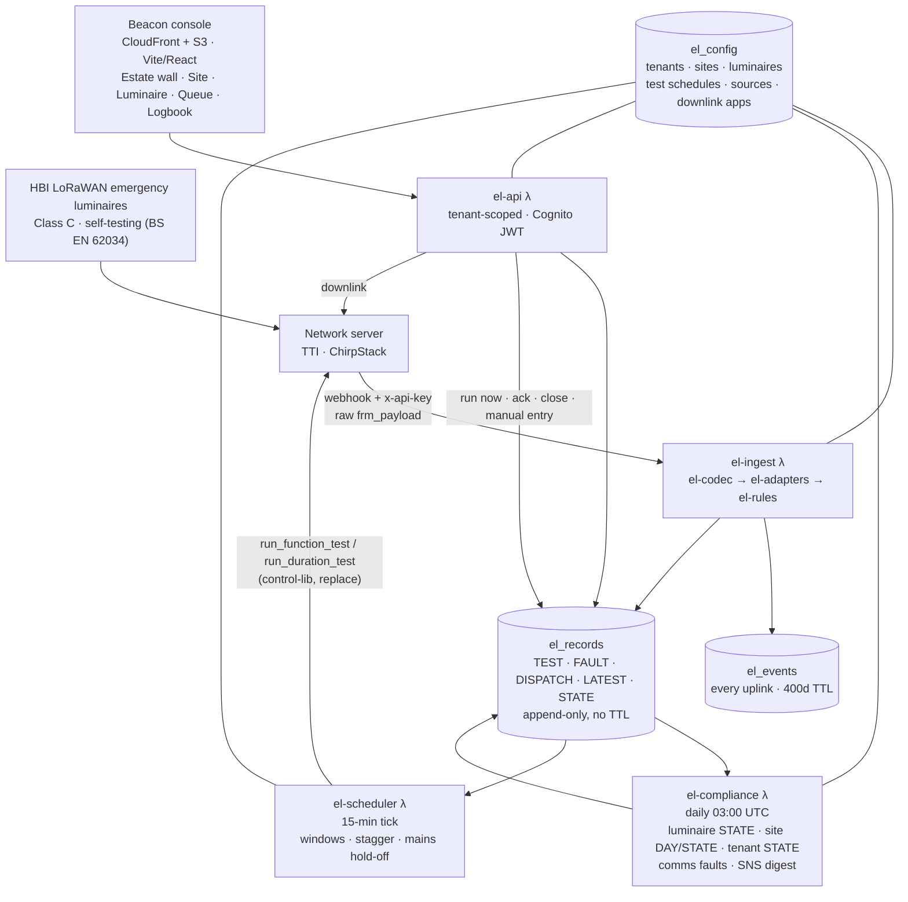

# nXzen Beacon — architecture

Fork of Pulse (see Pulse ARCHITECTURE.md for the AWS plumbing, which is identical).

## The one idea

Telemetry is not the product. The **record** is: an append-only TEST / FAULT
trail per luminaire, with a state cache the console reads and a daily rollup
that turns it into site and portfolio compliance. Everything the luminaire
sends lands in `el_events` for audit; `el_records` is what an inspector sees.

## What each layer decides

- **Codec** decodes bytes into typed events with named flags. Never infers.
- **Rules** decides pass/fail (duration ≥ rated; no failure flags in the window),
  opens faults from failure events, computes due/overdue against BS 5266-1
  intervals (31 d function, 365 d duration, with grace), and folds it into a
  three-state luminaire status: ok / warn / alert.
- **Compliance** runs the rules daily so the console never computes.
- **Scheduler** decides *when* to ask a luminaire to test: site window,
  stagger, skip after a real outage, one dispatch per occurrence.
- **API** is the only writer of human decisions (ack, close, manual entry).

## Scale posture

Pulse's: config scanned on cache miss, per-luminaire GetItems fanned out.
Fine to a few thousand luminaires; then add the `entity_type` GSI and batch
the STATE reads.
